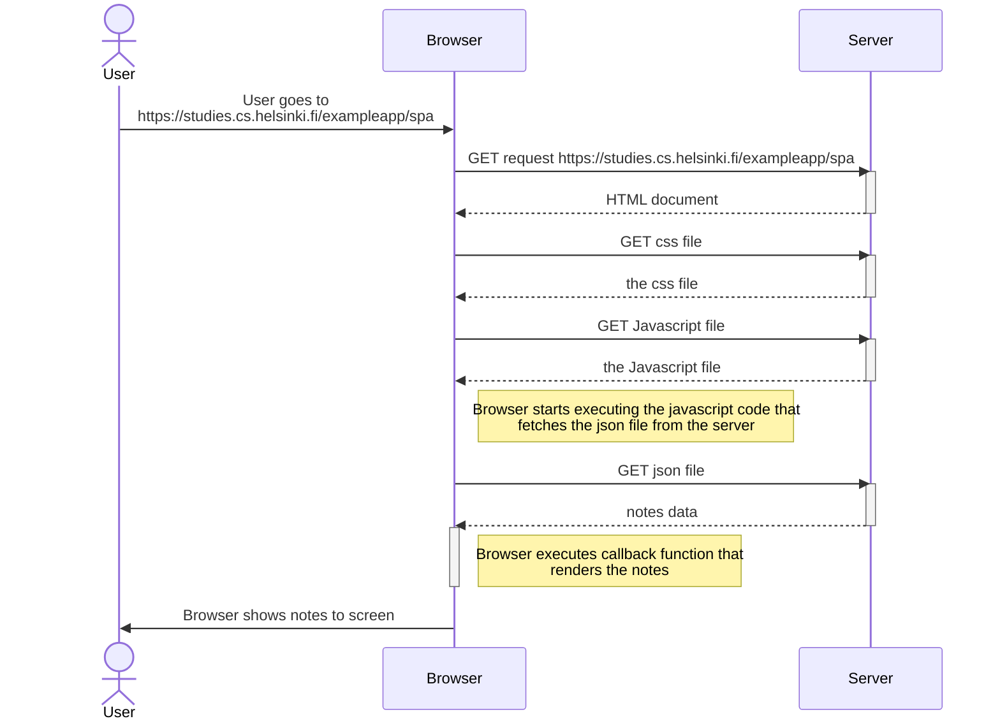

```mermaid
sequenceDiagram
    actor User
    participant Browser
    participant Server
    
    User->>Browser: User goes to<br> https://studies.cs.helsinki.fi/exampleapp/spa
    Browser->>Server: GET request https://studies.cs.helsinki.fi/exampleapp/spa
    activate Server
    Server-->>Browser: HTML document
    deactivate Server
    Browser->>Server: GET css file
    activate Server
    Server-->>Browser: the css file
    deactivate Server
    Browser->>Server: GET Javascript file
    activate Server
    Server-->>Browser: the Javascript file
    deactivate Server
    Note right of Browser: Browser starts executing the javascript code that<br> fetches the json file from the server 
    Browser->>Server: GET json file
    activate Server
    Server-->>Browser: notes data
    deactivate Server
    
    activate Browser
    Note right of Browser: Browser executes callback function that<br> renders the notes
    deactivate Browser
    Browser->>User: Browser shows notes to screen 
    
    
    
    
```