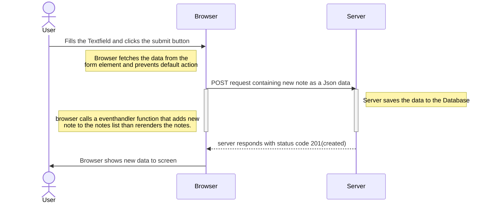

```mermaid
sequenceDiagram
    actor User
    participant Browser
    participant Server
    
    User->>Browser: Fills the Textfield and clicks the submit button
    Note left of Browser: Browser fetches the data from the <br>form element and prevents default action
    Browser->>Server: POST request containing new note as a Json data
    activate Server
    activate Browser
    Note right of Server: Server saves the data to the Database
    Note left of Browser: browser calls a eventhandler function that adds new <br>note to the notes list than rerenders the notes.
    deactivate Server
    deactivate Browser
    Server-->>Browser: server responds with status code 201(created)
    Browser->>User: Browser shows new data to screen 
    
    
```