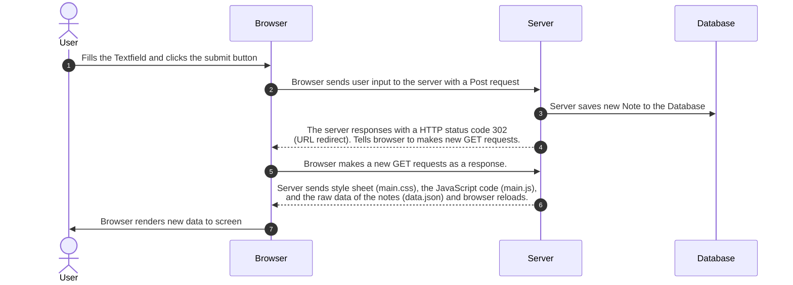

```mermaid
sequenceDiagram
    autonumber
    actor User
    participant Browser
    participant Server 
    participant Database

    User->>Browser: Fills the Textfield and clicks the submit button
    Browser->>Server: Browser sends user input to the server with a Post request
    Server->> Database: Server saves new Note to the Database
    Server-->> Browser: The server responses with a HTTP status code 302 <br>(URL redirect). Tells browser to makes new GET requests.
    Browser->>Server: Browser makes a new GET requests as a response.
    Server-->>Browser: Server sends style sheet (main.css), the JavaScript code (main.js),<br> and the raw data of the notes (data.json) and browser reloads.
    Browser->>User: Browser renders new data to screen 
```